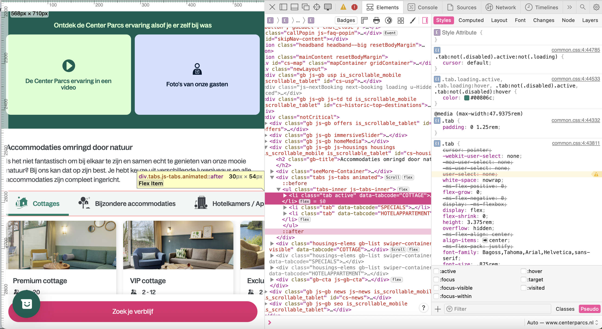
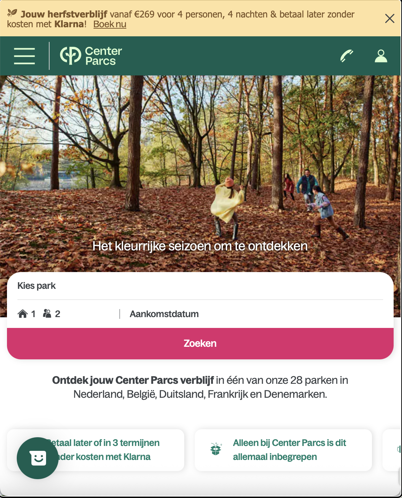
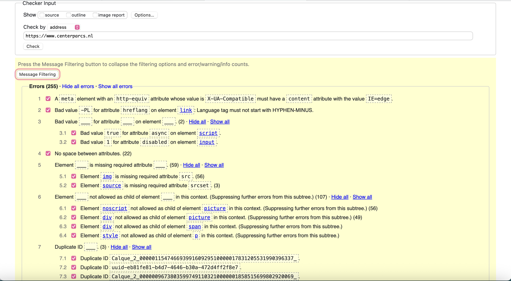
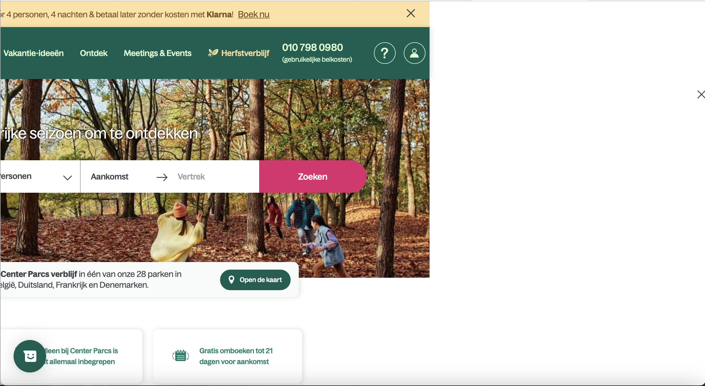
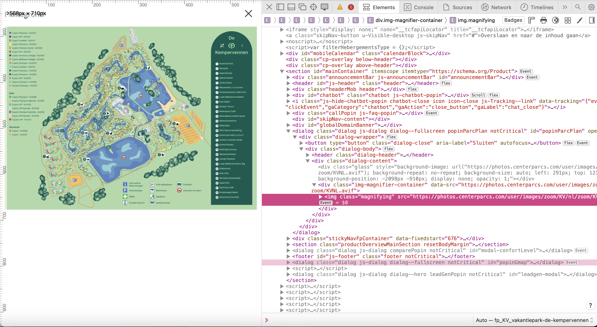
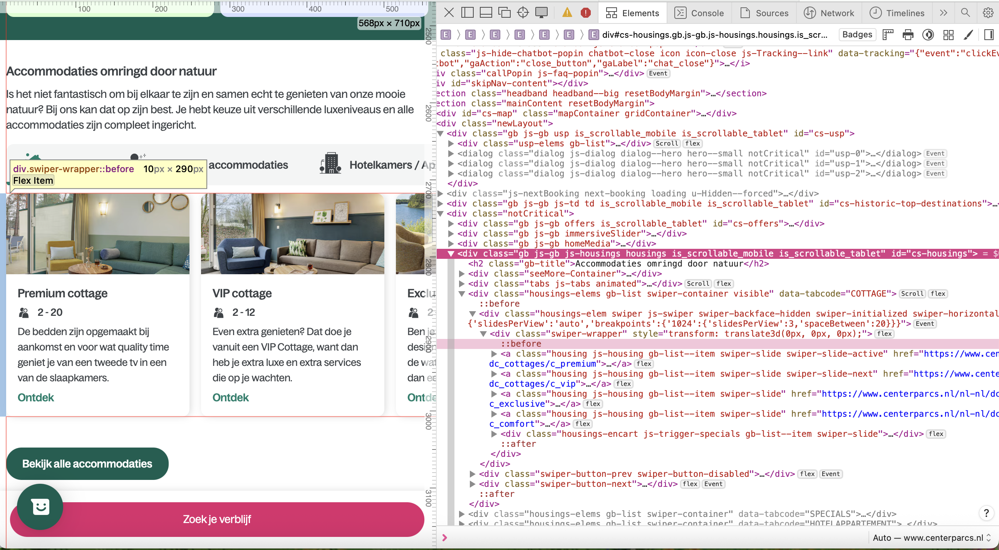
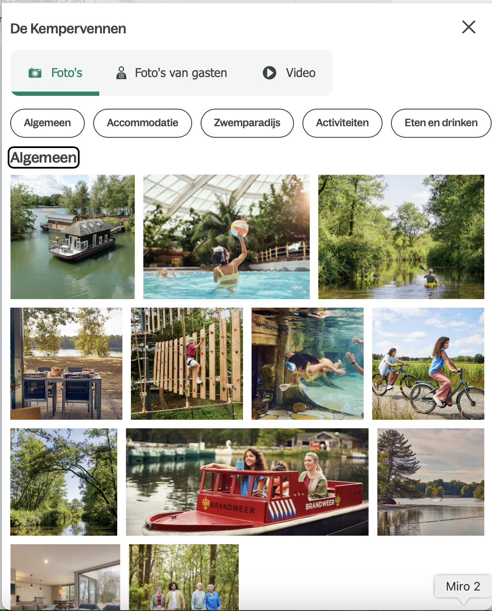

# Procesverslag
Markdown is een simpele manier om HTML te schrijven.  
Markdown cheat cheet: [Hulp bij het schrijven van Markdown](https://github.com/adam-p/markdown-here/wiki/Markdown-Cheatsheet).

Nb. De standaardstructuur en de spartaanse opmaak van de README.md zijn helemaal prima. Het gaat om de inhoud van je procesverslag. Besteedt de tijd voor pracht en praal aan je website.

Nb. Door *open* toe te voegen aan een *details* element kun je deze standaard open zetten. Fijn om dat steeds voor de relevante stuk(ken) te doen.

## Jij

  
uitwerken voor kick-off werkgroep

  ### Auteur:
  Anna Tolhuis

  #### Je startniveau:
  Blauw

  #### Je focus:
  responsive, maar ik wil ook graag een dark mode toevoegen aan mijn website en kijken of ik bepaalde stukken kan verbeteren aan de website als ik daar tijd voor heb.
 

## Je website

  
uitwerken voor kick-off werkgroep

  ### Je opdracht:
  [Center Parcs](https://www.centerparcs.nl)

  #### Screenshot(s) van de eerste pagina (small screen): 
  De home pagina
  

  #### Screenshot(s) van de tweede pagina (small screen):
  Accomodatie pagina - Huttenheugte
  
 

## Toegankelijkheidstest 1/2 (week 1)

  
uitwerken na test in 2e werkgroep

  ### Bevindingen
  Lijst met je bevindingen die in de test naar voren kwamen:

  Bevinding afbeeldingen.
  
  
  
  
  
  
  
  

    Test 1: Screen reader
  - Begint met H4, loopt verder wel op volgorde van H1 naar H3 en heeft ook maar 1 H1 per pagina.
  - Gaat niet over alle Buttons en links
  - De meeste links zijn duidelijk aangegeven de namen van sommige links zijn wel heel erg lang.
  - Een paar links hebben een vragtekens door dat ze alleen icons hebben en 1 link heeft alleen een /.
  - Buttons hebben button als naam of ook weer de vraagtekens van de icons.
  - Elementen die met JS verborgen zijn zeggen geen links of buttons te hebben.

  Test 2: WCAG Check list
  Content:
  - Sommige links heten meer info of hebben geen naam en alleen een icon. De links met meer info wordt door de screenreader over heen gelezen.
  - Buttons hebben veel ?.

  Global code:
  - 255 errors
  - 15 warnings
  - 71 info messages (Niet iets om zorgen om te maken)
  - Heeft zelfs speciaal voor de karten een vergrootglas functie om de kaart beter te lezen.

  Keyboard:
  - Bij de screenreader gaat hij van het scherm voor knoppen en hamburger menu gaat hij doorheen maar hij opent hem niet dus je gaat er onzichtbaar door heen.

  Mobile and touch:
  - Horizontal scroling niet op telefoon, maar wel op destop.
  - Er zit overal veel en genoeg ruimte tussen knoppen behalve bij het kies park menu dit is erg klein.

  Headings:
  - Begint met H4

  Lists:
  - Gebruiken voornamelijk div

  Images:
  - sommige afbeeldingen hebben geen alt
  - Kaart heeft geen alt

  Media:
  Ze hebben weinig video's en audio onderdelen. Alleen de home pagina heeft boven in een video die automatisch afspeelt. Deze heeft geen geluid en kan je ook niet uitzetten.

  Controls:
  - Sommige links zijn a, sommige zijn div
  - Sommige buttos zijn div, sommige zijn buttons.

  Appearance:
  - Geen dark mode

  Animation:
  Er is een kleine animatie die niet herhaalt en niet snel afspeeld. Deze kan je alleen niet uitzetten en ook niet voor kiezen om niet af te spelen.

  Color contrast:
  - Op AA niveau checkt alles Ja.
  - Op sommige scoort ook de AAA niveau zelfs Ja.
  - Ik weet niet precies wat hij bedoelt met custom selection colors.

## Breakdownschets (week 1)

  
uitwerken na afloop 3e werkgroep

  ### de hele pagina: 
  
  

  ### dynamisch deel (bijv menu): 
  

  ### wellicht nog een dynamisch deel (bijv filter): 
  

## Voortgang 1 (week 2)

  
uitwerken voor 1e voortgang

  ### Stand van zaken
  hier dit ging goed & dit was lastig (neem ook screenshots op van delen van je website en code)

  ### Agenda voor meeting
  samen met je groepje opstellen

  | student 1      | student 2          | student 3    | Anna       |
  | ---            | ---                | ---          | ---              |
  | dit bespreken  | en dit             | en ik dit    | Hoe kan je een forum stylen? |
  | en dat ook nog | dit als er tijd is | nog een punt | Klopt de forum structuur? |
  | ...            | ...                | ...          |  |

  ### Verslag van meeting
  hier na afloop snel de uitkomsten van de meeting vastleggen

  - Je mag meer dan 1 nav in je header
  - Je header hoeft niet zo extreem uitgebreid 
  - Js in je forum zou ik niet doen is te gecompliseerd
  - Section -> Forum -> Select -> option hoort een label voor de eerste optie
			label las van selectie
			select id en label for
			label hoef je niet te zien a11i visually hidden voor verstoppen
			elk onderdeel heeft een label nodig mag niet zomaar een li gebruiken maar hier heb je hem nodig om ze te koppelen!
			voor calender input type "date" zelf opzoeken welke
			select gebruiken voor simpele drop dropdown voor styling mag je imput type text gebruiken
			CSS -> vragen als ik er aan toe ben.

## Voortgang 2 (week 3)

  
uitwerken voor 2e voortgang

  ### Stand van zaken
  hier dit ging goed & dit was lastig (neem ook screenshots op van delen van je website en code)

  ### Agenda voor meeting
  samen met je groepje opstellen

  | student 1      | student 2          | student 3    | Anna       |
  | ---            | ---                | ---          | ---              |
  | dit bespreken  | en dit             | en ik dit    | Hoe kan ik deze Carousel met JS goed aanspreken ik heb nu dit, maar het werkt niet...  |
  | en dat ook nog | dit als er tijd is | nog een punt |  |
  | ...            | ...                | ...          |  |

  ### Verslag van meeting
  hier na afloop snel de uitkomsten van de meeting vastleggen

  - Gebruik inspect tool om je eigen site te controleren.
  - Gebruik inspect tool om te kijken naar hoe de andere website het heeft gedaan.
  - If else gebruiken voor de courses laten rouleren nu haal je iets weg en doe je er iets bij bij alle 3 tegelijkertijd en dat werkt niet.
  - Div en class aanpassen met nth:of-type() ect
  - Live server toevoegen aan visual studio code, dan kan je je aanpassingen live zien.

## Toegankelijkheidstest 2/2 (week 4)

  
uitwerken na test in 9e werkgroep

  ### Bevindingen
  Lijst met je bevindingen die in de test naar voren kwamen (geef ook aan wat er verbeterd is):
  - De volgorde van headings heb ik verbeterd sommige zaten niet goed of onlogisch
  - Ik heb een dark mode toegevoegd aan mijn pagina de orginele heeft dit niet
  - Sommige links zijn a, sommige zijn div dit heb ik aangepast zodat er geen div links meer zijn
  - Sommige buttos zijn div, sommige zijn buttons. Ook dit aangepast geen div's meer
  - Animatie, audio en video NVT heb ik niet op mijn pagina's
  - Op AA niveau checkt alles Ja. Dat deed het orgineel ook al.

## Voortgang 3 (week 4)

  
uitwerken voor 3e voortgang

  ### Stand van zaken
  hier dit ging goed & dit was lastig (neem ook screenshots op van delen van je website en code)

  ### Agenda voor meeting
  samen met je groepje opstellen

  | student 1      | student 2          | student 3    | Anna       |
  | ---            | ---                | ---          | ---              |
  | dit bespreken  | en dit             | en ik dit    | Hoe kan ik deze vorm kirijgen in deze afbeelding  |
  | en dat ook nog | dit als er tijd is | nog een punt |  |
  | ...            | ...                | ...          |      |

  ### Verslag van meeting
  hier na afloop snel de uitkomsten van de meeting vastleggen

  - <video width=… muted>
  - Source
  - Stijling bijna zelfde als img
  - Button op z-index want er zit een laagje over heen
  - Pauzeren en spelen doormiddel met if els statements 
  - .src Afbeelding buiten source veranderen bij if els statements
  - .alt omschrijving tekst aanpassen van de img
  - Css shape()
  - Css clippy
  - Div
  - Mask img
  - Mask size
  - Mask repeat
  - Boarder tedious gebruik makkelijker dan clipy of maak
  - Section nth of type pakt ook vanaf 1 in je folter als je daar sections hebt
  - Background image: linear gradient (45deg, kleur 50%, kleur 50%)
  - Background size: 250% 250%
  - Background position: right
  - Met over dan position left

## Eindgesprek (week 5)

  
uitwerken voor eindgesprek

  ### Je uitkomst - karakteristiek screenshots:
  
  

  ### Dit ging goed/Heb ik geleerd: 
  Een carousel laten besturen met JS. Ben erg tevreden met het eindresultaat het is niet voledig het zelfde als de website maar hij werkt en daar ben ik heel blij mee.

  

  ### Dit was lastig/Is niet gelukt:
 Het sticky maken van navigatie in de 1e sectie op mijn 2e pagina. Hij wilde het niet doen en ik weet niet waarom dus dat is helaas niet gelukt.

  

## Bronnenlijst

  
continu bijhouden terwijl je werkt

  Nb. Wees specifiek ('css-tricks' als bron is bijv. niet specifiek genoeg). 
  Nb. ChatGpT en andere AI horen er ook bij.
  Nb. Vermeld de bronnen ook in je code.

  1. (https://www.youtube.com/watch?v=2O8pkybH6po Extra hulp voor forum types)
  2. Chat GPT
  3. (https://codepen.io/shooft/pen/ZYQMVWy) Voor de courosel
  4. Clip-path gemaakt met https://bennettfeely.com/clippy/
  5. grid regel grid-template-columns: repeat( auto-fit, minmax(16em, 1fr) );

