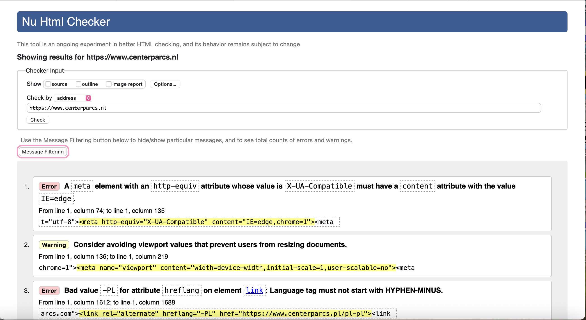

# Procesverslag
Markdown is een simpele manier om HTML te schrijven.  
Markdown cheat cheet: [Hulp bij het schrijven van Markdown](https://github.com/adam-p/markdown-here/wiki/Markdown-Cheatsheet).

Nb. De standaardstructuur en de spartaanse opmaak van de README.md zijn helemaal prima. Het gaat om de inhoud van je procesverslag. Besteedt de tijd voor pracht en praal aan je website.

Nb. Door *open* toe te voegen aan een *details* element kun je deze standaard open zetten. Fijn om dat steeds voor de relevante stuk(ken) te doen.

## Jij

  
uitwerken voor kick-off werkgroep

  ### Auteur:
  Anna Tolhuis

  #### Je startniveau:
  Blauw het kan altijd omhoog

  #### Je focus:
  responsive, maar ik wil ook graag een dark mode toevoegen aan mijn website en kijken of ik bepaalde stukken kan verbeteren aan de website als ik daar tijd voor heb.
 

## Je website

  
uitwerken voor kick-off werkgroep

  ### Je opdracht:
  [Center Parcs](https://www.centerparcs.nl)

  #### Screenshot(s) van de eerste pagina (small screen): 
  De home pagina
  

  #### Screenshot(s) van de tweede pagina (small screen):
  Accomodatie pagina - Huttenheugte
  
 

## Toegankelijkheidstest 1/2 (week 1)

  
uitwerken na test in 2e werkgroep

  ### Bevindingen
  Lijst met je bevindingen die in de test naar voren kwamen:

  Bevinding afbeeldingen.
  
  
  
  
  
  
  
  

    Test 1: Screen reader
  - Begint met H4, loopt verder wel op volgorde van H1 naar H3 en heeft ook maar 1 H1 per pagina.
  - Gaat niet over alle Buttons en links
  - De meeste links zijn duidelijk aangegeven de namen van sommige links zijn wel heel erg lang.
  - Een paar links hebben een vragtekens door dat ze alleen icons hebben en 1 link heeft alleen een /.
  - Buttons hebben button als naam of ook weer de vraagtekens van de icons.
  - Elementen die met JS verborgen zijn zeggen geen links of buttons te hebben.

  Test 2: WCAG Check list
  Content:
  - Sommige links heten meer info of hebben geen naam en alleen een icon. De links met meer info wordt door de screenreader over heen gelezen.
  - Buttons hebben veel ?.

  Global code:
  - 255 errors
  - 15 warnings
  - 71 info messages (Niet iets om zorgen om te maken)
  - Heeft zelfs speciaal voor de karten een vergrootglas functie om de kaart beter te lezen.

  Keyboard:
  - Bij de screenreader gaat hij van het scherm voor knoppen en hamburger menu gaat hij doorheen maar hij opent hem niet dus je gaat er onzichtbaar door heen.

  Mobile and touch:
  - Horizontal scroling niet op telefoon, maar wel op destop.
  - Er zit overal veel en genoeg ruimte tussen knoppen behalve bij het kies park menu dit is erg klein.

  Headings:
  - Begint met H4

  Lists:
  - Gebruiken voornamelijk div

  Images:
  - sommige afbeeldingen hebben geen alt
  - Kaart heeft geen alt

  Media:
  Ze hebben weinig video's en audio onderdelen. Alleen de home pagina heeft boven in een video die automatisch afspeelt. Deze heeft geen geluid en kan je ook niet uitzetten.

  Controls:
  - Sommige links zijn a, sommige zijn div
  - Sommige buttos zijn div, sommige zijn buttons.

  Appearance:
  - Geen dark mode

  Animation:
  Er is een kleine animatie die niet herhaalt en niet snel afspeeld. Deze kan je alleen niet uitzetten en ook niet voor kiezen om niet af te spelen.

  Color contrast:
  - Op AA niveau checkt alles Ja.
  - Op sommige scoort ook de AAA niveau zelfs Ja.
  - Ik weet niet precies wat hij bedoelt met custom selection colors.

## Breakdownschets (week 1)

  
uitwerken na afloop 3e werkgroep

  ### de hele pagina: 
  

  ### dynamisch deel (bijv menu): 
  

  ### wellicht nog een dynamisch deel (bijv filter): 
  

## Voortgang 1 (week 2)

  
uitwerken voor 1e voortgang

  ### Stand van zaken
  hier dit ging goed & dit was lastig (neem ook screenshots op van delen van je website en code)

  ### Agenda voor meeting
  samen met je groepje opstellen

  | student 1      | student 2          | student 3    | Anna       |
  | ---            | ---                | ---          | ---              |
  | dit bespreken  | en dit             | en ik dit    | Im mijn carousel link ik door naar de volgende pagina per blokje. De link die is niet klikbaar, omdat alles er boven op ligt ook maak ik nu veel gebruik van div's en classes, maar hoe kan ik zorgen dat hij werkt en daar minder gebruik van maakt? Ook zit er een nav in maar mag dit wel buiten de header? |
  | en dat ook nog | dit als er tijd is | nog een punt | Ook wordt hij aangesproken met JS, maar op het moment werkt dit niet hoe zorg ik er voor dat het wel werkt? |
  | ...            | ...                | ...          | Mijn footer ziet er zo uit met ook uitklapbaar, mag ik dit net als de header simpeler maken of moet dit wel echt helemaal zo uit gewerkt zoals ik nu heb?         |

  ### Verslag van meeting
  hier na afloop snel de uitkomsten van de meeting vastleggen

  - punt 1
  - punt 2
  - nog een punt
  - ...

## Voortgang 2 (week 3)

  
uitwerken voor 2e voortgang

  ### Stand van zaken
  hier dit ging goed & dit was lastig (neem ook screenshots op van delen van je website en code)

  ### Agenda voor meeting
  samen met je groepje opstellen

  | student 1      | student 2          | student 3    | student 4        |
  | ---            | ---                | ---          | ---              |
  | dit bespreken  | en dit             | en ik dit    | en dan ik dat    |
  | en dat ook nog | dit als er tijd is | nog een punt | dit wil ik zeker |
  | ...            | ...                | ...          | ...              |

  ### Verslag van meeting
  hier na afloop snel de uitkomsten van de meeting vastleggen

  - punt 1
  - punt 2
  - nog een punt
- ...

## Toegankelijkheidstest 2/2 (week 4)

  
uitwerken na test in 9e werkgroep

  ### Bevindingen
  Lijst met je bevindingen die in de test naar voren kwamen (geef ook aan wat er verbeterd is):

## Voortgang 3 (week 4)

  
uitwerken voor 3e voortgang

  ### Stand van zaken
  hier dit ging goed & dit was lastig (neem ook screenshots op van delen van je website en code)

  ### Agenda voor meeting
  samen met je groepje opstellen

  | student 1      | student 2          | student 3    | student 4        |
  | ---            | ---                | ---          | ---              |
  | dit bespreken  | en dit             | en ik dit    | en dan ik dat    |
  | en dat ook nog | dit als er tijd is | nog een punt | dit wil ik zeker |
  | ...            | ...                | ...          | ...              |

  ### Verslag van meeting
  hier na afloop snel de uitkomsten van de meeting vastleggen

  - punt 1
  - punt 2
  - nog een punt
  - ...

## Eindgesprek (week 5)

  
uitwerken voor eindgesprek

  ### Je uitkomst - karakteristiek screenshots:
  

  ### Dit ging goed/Heb ik geleerd: 
  Korte omschrijving met plaatjes

  

  ### Dit was lastig/Is niet gelukt:
  Korte omschrijving met plaatjes

  

## Bronnenlijst

  
continu bijhouden terwijl je werkt

  Nb. Wees specifiek ('css-tricks' als bron is bijv. niet specifiek genoeg). 
  Nb. ChatGpT en andere AI horen er ook bij.
  Nb. Vermeld de bronnen ook in je code.

  1. bron 1
  2. bron 2
  3. ...

